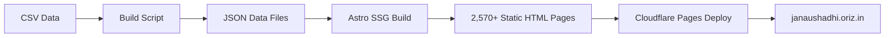

# 🏪 Janaushadhi Store — Implementation Plan

> **janaushadhi.oriz.in** — Chirag Singhal's Jan Aushadhi Kendra
> Unofficial store website · Pickup & COD only · No online payments

---

## 📊 Data Summary

| Metric | Value |
|--------|-------|
| Total Medicines | **2,439** |
| Categories (Groups) | **63** |
| Priced Items (MRP > 0) | **2,052** |
| Price on Request (MRP = 0) | **387** |
| CSV Columns | Sr No, Drug Code, Generic Name, Unit Size, MRP, Group Name |
| Price Range | ₹2.07 – ₹2,718.75 |

---

## 🏗️ Architecture Decision

### Framework: **Astro** + React Islands

| Why Astro | Benefit |
|-----------|---------|
| Static Site Generation (SSG) | 2,439+ individual product pages, all pre-rendered |
| Islands Architecture | React components only where interactivity needed (search, cart, auth) |
| Built-in SEO | Automatic sitemap, RSS, meta tags |
| Zero JS by default | Lightning fast page loads → better AdSense CLS |
| Content Collections | Type-safe data layer for medicine CSV |
| PWA support | Via `@vite-pwa/astro` |

### Key Stack

| Layer | Technology |
|-------|-----------|
| Framework | Astro 5.x (SSG mode) |
| Interactive Islands | React 19 |
| Auth | Firebase Auth (Google Sign-in) |
| Database | Firebase Firestore (user profiles, orders, wishlists) |
| Email Notifications | EmailJS (order → store email) |
| Styling | Vanilla CSS with CSS custom properties |
| Search | Client-side Fuse.js (fuzzy search on static JSON) |
| Deployment | Cloudflare Pages |
| PWA | @vite-pwa/astro |
| Analytics | Google Analytics 4 + Cloudflare Web Analytics |
| Ads | Google AdSense |

---

## 📐 Site Architecture & Pages

### Static Pages (SSG at build time)

```
/                          → Homepage (hero, featured categories, search)
/medicines/                → All medicines listing (paginated, filterable, sortable)
/medicines/[slug]/         → Individual medicine page (2,439 pages)
/categories/               → All categories listing
/categories/[slug]/        → Category page (63 pages)
/cart/                     → Shopping cart
/checkout/                 → Checkout (pickup/COD form)
/orders/                   → Order history (auth required)
/account/                  → User profile (auth required)
/about/                    → About the store
/contact/                  → Contact page with map
/search/                   → Search results page
/privacy-policy/           → Privacy Policy
/terms-of-service/         → Terms of Service
/disclaimer/               → Disclaimer (unofficial store notice)
/cookie-policy/            → Cookie Policy
/refund-policy/            → Refund/Return Policy
```

### Total Generated Pages: **~2,570+**

---

## 🎨 Design Direction

### Aesthetic: **Clean Pharmaceutical + Indian Government Trustworthiness**

- **Color Palette**: Jan Aushadhi official blue (#1a5276) + saffron accent (#ff6b35) + clean whites + soft greys
- **Typography**:
  - Display: **DM Serif Display** (authoritative, pharmaceutical)
  - Body: **Source Sans 3** (clean readability for medicine names)
  - Mono: **JetBrains Mono** (drug codes, prices)
- **Vibe**: Professional medical store — not flashy e-commerce — trustworthy, clean, accessible
- **Key Visual**: Pill/capsule iconography, subtle cross-hatch medical pattern background
- **Mobile-first**: 70%+ traffic will be mobile

---

## 🔧 Feature Breakdown

### Phase 1: Core Static Site

1. **Homepage**
   - Hero with search bar (prominent, Google-like)
   - Quick category pills (top 10 categories)
   - "Price on Request" banner
   - Store info card (address, hours, phone)
   - Unofficial store disclaimer banner

2. **Medicine Catalog (`/medicines/`)**
   - Grid/list toggle view
   - Filters:
     - By Category (63 groups — multi-select)
     - By Price Range (slider)
     - Show/Hide "Price on Request" items (MRP=0)
     - Show/Hide Free items
   - Sorting:
     - Price: Low → High
     - Price: High → Low
     - Name: A → Z
     - Name: Z → A
     - Drug Code
     - Category
   - Pagination (24 items/page)
   - Result count display

3. **Individual Medicine Page (`/medicines/[slug]/`)**
   - Medicine name (Generic Name)
   - Drug Code
   - Unit Size
   - MRP (or "Price on Request" badge)
   - Category with link
   - "Add to Cart" button
   - Related medicines (same category)
   - SEO: unique title, meta description, structured data (Product schema)
   - Share buttons (WhatsApp, copy link)

4. **Category Pages (`/categories/[slug]/`)**
   - All medicines in that category
   - Same filter/sort as main catalog
   - Category description (auto-generated)
   - Medicine count

5. **Search**
   - Client-side Fuse.js fuzzy search
   - Search by: Generic Name, Drug Code, Category
   - Auto-suggestions / typeahead
   - Search results page with filters
   - URL-queryable (`/search?q=paracetamol`)

### Phase 2: Cart & Orders

6. **Shopping Cart**
   - Add/remove items
   - Quantity selector
   - Cart persisted in localStorage (guest) or Firestore (logged in)
   - Cart summary with total
   - "Price on Request" items show "Contact for price"

7. **Checkout**
   - Customer details form:
     - Name, Phone, Email, Address
   - Order type: Pickup / COD
   - Order notes
   - Order summary
   - Submit → EmailJS sends:
     - Email to store (`hi@janaushadhi.oriz.in`)
     - Confirmation email to customer
   - Order saved to Firestore
   - Order confirmation page with order ID

8. **Order History** (auth required)
   - List of past orders
   - Order details view
   - Order status (Pending → Confirmed → Ready → Completed)

### Phase 3: Auth & User Features

9. **Firebase Auth**
   - Google Sign-in (primary)
   - Phone number auth (Indian numbers)
   - Guest checkout allowed
   - Profile page (name, phone, addresses)

10. **Wishlist**
    - Save medicines for later
    - Synced via Firestore

### Phase 4: PWA & Advanced

11. **PWA**
    - Installable on Android/iOS
    - Offline browsing of medicine catalog
    - Push notifications for order updates
    - App icon with Jan Aushadhi branding

12. **SEO Optimization**
    - Individual `<title>` per medicine: `{Medicine Name} - ₹{MRP} | Jan Aushadhi Store Bhubaneswar`
    - Structured data (Product, LocalBusiness, BreadcrumbList)
    - Sitemap.xml (auto-generated)
    - robots.txt
    - Open Graph + Twitter Cards
    - Canonical URLs

13. **Legal & Compliance**
    - Prominent "Unofficial Store" disclaimer
    - Privacy Policy (GDPR/IT Act compliant)
    - Terms of Service
    - Cookie Policy (consent banner)
    - Refund Policy

14. **AdSense & Analytics**
    - Google AdSense integration
    - ads.txt at root
    - GA4 tracking
    - Cloudflare Web Analytics (backup)

---

## 📁 Project Structure

```
janaushadhi.oriz.in/
├── astro.config.mjs
├── package.json
├── tsconfig.json
├── public/
│   ├── manifest.json          # PWA manifest
│   ├── ads.txt                # AdSense
│   ├── robots.txt
│   ├── favicon.svg
│   └── icons/                 # PWA icons
├── src/
│   ├── components/
│   │   ├── Header.astro
│   │   ├── Footer.astro
│   │   ├── MedicineCard.astro
│   │   ├── SearchBar.tsx       # React island
│   │   ├── CartWidget.tsx      # React island
│   │   ├── FilterPanel.tsx     # React island
│   │   ├── AuthButton.tsx      # React island
│   │   └── CookieConsent.tsx   # React island
│   ├── layouts/
│   │   └── BaseLayout.astro
│   ├── pages/
│   │   ├── index.astro
│   │   ├── medicines/
│   │   │   ├── index.astro
│   │   │   └── [slug].astro    # Dynamic routes → 2,439 pages
│   │   ├── categories/
│   │   │   ├── index.astro
│   │   │   └── [slug].astro    # 63 pages
│   │   ├── cart.astro
│   │   ├── checkout.astro
│   │   ├── search.astro
│   │   ├── about.astro
│   │   ├── contact.astro
│   │   ├── privacy-policy.astro
│   │   ├── terms-of-service.astro
│   │   ├── disclaimer.astro
│   │   ├── cookie-policy.astro
│   │   └── refund-policy.astro
│   ├── data/
│   │   ├── medicines.json      # Processed CSV → JSON
│   │   └── categories.json     # Derived categories
│   ├── lib/
│   │   ├── firebase.ts         # Firebase config
│   │   ├── emailjs.ts          # EmailJS config
│   │   ├── cart.ts             # Cart logic
│   │   ├── search.ts           # Fuse.js setup
│   │   └── utils.ts            # Slug generation, formatting
│   └── styles/
│       ├── global.css          # Design system
│       └── components.css      # Component styles
├── data.csv                    # Source data
├── scripts/
│   └── process-csv.mjs         # CSV → JSON build script
└── .env                        # Secrets
```

---

## 🔐 Environment Variables Needed

```env
# Already present
CLOUDFLARE_GLOBAL_API_KEY=...
CLOUDFLARE_ORIGIN_CA_KEY=...
CLOUDFLARE_EMAIL=...
CLOUDFLARE_ACCOUNT_ID=...

# Need from you
FIREBASE_API_KEY=
FIREBASE_AUTH_DOMAIN=
FIREBASE_PROJECT_ID=
FIREBASE_STORAGE_BUCKET=
FIREBASE_MESSAGING_SENDER_ID=
FIREBASE_APP_ID=

EMAILJS_SERVICE_ID=
EMAILJS_TEMPLATE_ID=
EMAILJS_PUBLIC_KEY=

PUBLIC_GA_MEASUREMENT_ID=         # GA4
PUBLIC_ADSENSE_CLIENT_ID=         # ca-pub-xxxxx
```

---

## 🚀 Deployment Flow



### Cloudflare Setup
1. Create CNAME: `janaushadhi` → Cloudflare Pages project
2. Configure custom domain in Pages dashboard
3. Email routing: `hi@janaushadhi.oriz.in` → `whyiswhen@gmail.com`
4. Email routing: `support@janaushadhi.oriz.in` → `whyiswhen@gmail.com`

---

## ❓ Questions Before Implementation

> [!IMPORTANT]
> Please answer these before I begin building:

### 1. Firebase Configuration
Please paste your Firebase config keys into the `.env` file:
- `FIREBASE_API_KEY`
- `FIREBASE_AUTH_DOMAIN`
- `FIREBASE_PROJECT_ID`
- `FIREBASE_STORAGE_BUCKET`
- `FIREBASE_MESSAGING_SENDER_ID`
- `FIREBASE_APP_ID`

### 2. EmailJS Configuration
Please paste your EmailJS keys:
- `EMAILJS_SERVICE_ID`
- `EMAILJS_TEMPLATE_ID` (or should I help you create the template?)
- `EMAILJS_PUBLIC_KEY`

### 3. Google AdSense & Analytics
- Do you have a Google AdSense publisher ID (`ca-pub-xxxxx`)?
- Do you have a GA4 Measurement ID (`G-xxxxx`)?
- Or should I set up the placeholders and you add them later?

### 4. Store Details Confirmation
- **Store Name**: Chirag Singhal's Janaushadhi Kendra
- **Address**: Plot #448, Niladri Vihar, Lane 5, Sector 5, Chandrasekharpur, Bhubaneswar, Odisha
- **Phone**: 7428449707
- **Hours**: 24/7
- **Email**: hi@janaushadhi.oriz.in
- Is everything correct? Any additional contact details?

### 5. Order Email Template
When an order is placed, the email should include:
- Customer name, phone, email, address
- Order items with quantities and prices
- Total amount
- Order type (Pickup/COD)
- Order notes

Should the email go to **both** `hi@janaushadhi.oriz.in` and `whyiswhen@gmail.com`, or just one?

---

## 💡 Additional Feature Suggestions

Here are features I recommend adding to enhance the user experience:

| Feature | Impact | Effort |
|---------|--------|--------|
| **WhatsApp Order** | Users can send cart via WhatsApp directly | Low |
| **Medicine Comparison** | Compare 2-3 medicines side-by-side | Medium |
| **Recently Viewed** | Track last 10 viewed medicines | Low |
| **Popular Medicines** | Highlight most-searched/ordered | Low |
| **Nearby Pharmacies** | Google Maps integration showing other Jan Aushadhi stores | Medium |
| **Drug Interaction Checker** | Basic warning when combining certain drugs | High |
| **Hindi/Odia Language Toggle** | Multi-language support for local users | High |
| **Prescription Upload** | Upload prescription image with order | Medium |
| **Medicine Reminders** | Set reminders via push notifications | Medium |
| **Price Comparison** | Show branded vs generic price savings | Medium |
| **Category Health Guides** | Simple educational content per category | Medium |
| **Bulk Order Form** | For hospitals/clinics ordering in bulk | Low |
| **QR Code per Medicine** | Scan to view medicine page | Low |
| **Print Order Summary** | Print-friendly order receipt | Low |
| **Dark Mode** | Accessibility + modern feel | Low |
Search the web multiple times and implement all of the features which are being suggested by the Ai here
### My Top 5 Recommendations:
1. **WhatsApp Order** — Most Indian users prefer WhatsApp for orders
2. **Recently Viewed** — Helps users find medicines they browsed
3. **Dark Mode** — Accessibility and modern feel
4. **Prescription Upload** — Adds legitimacy and usefulness
5. **Print Order Summary** — Practical for in-store pickup

---

## 📋 Implementation Phases

### Phase 1 — Foundation (Day 1)
- [ ] Astro project setup with pnpm
- [ ] CSV → JSON data pipeline
- [ ] Design system (CSS variables, typography, colors)
- [ ] Base layout with header/footer
- [ ] Homepage

### Phase 2 — Catalog (Day 1-2)
- [ ] All medicines listing page
- [ ] Individual medicine pages (2,439)
- [ ] Category pages (63)
- [ ] Search functionality (Fuse.js)
- [ ] Filter & sort panels

### Phase 3 — Commerce (Day 2)
- [ ] Cart system (localStorage)
- [ ] Checkout flow
- [ ] EmailJS integration
- [ ] Firebase Auth
- [ ] Firestore order storage

### Phase 4 — Polish (Day 2-3)
- [ ] PWA setup
- [ ] SEO (structured data, sitemap, meta)
- [ ] Legal pages
- [ ] AdSense + Analytics
- [ ] Cookie consent
- [ ] Cloudflare deployment
- [ ] DNS + email routing setup

### Phase 5 — Extras (Day 3)
- [ ] WhatsApp ordering
- [ ] Recently viewed
- [ ] Dark mode
- [ ] README + CI/CD
- [ ] GitHub repo metadata

---

> [!CAUTION]
> **Unofficial Store Disclaimer**: Every page will prominently display:
> *"This is an unofficial website. Not affiliated with the Government of India or BPPI (Bureau of Pharma PSUs of India). For official information, visit janaushadhi.gov.in"*
Search the web multiple times and implement all of the features which are being suggested by the Ai here